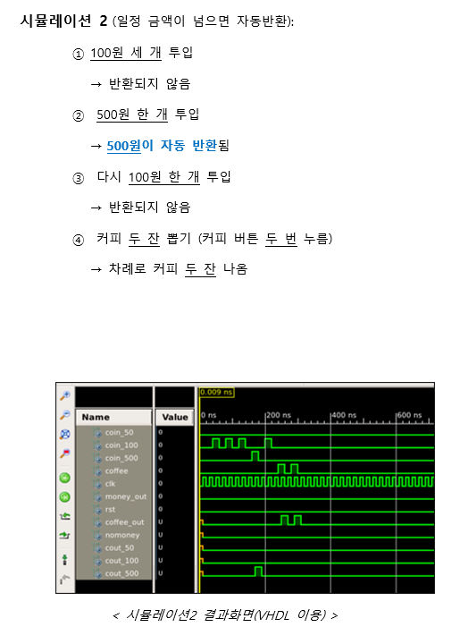

**본 폴더는 논리회로 설계 과목을 통해 VHDL을 이용하여 커피 자판기 만들기 프로젝트를 진행한 폴더입니다.**  


### 주제

  **Finite State Machine을 이용하여 커피 자판기 만들기**
  


### 커피 자판기의 동작 조건
 > 동전의 종류 : 50원 , 100원, 500원  
 
 > 커피의 가격 : 200원  
 
 > 리셋 버튼 : 리셋 작동 시 잔액 초기화  
 
 > 자판기 최대 수용 금액 : 최대 750원, 초과시 자동 반환  
 
### 프로그램 변수  

   ```
   entity term_vd_mod is
          port (coin_50,coin_100,coin_500 : in std_logic ;          -- 50원, 100원, 500원 동전 입력 신호  
                coffee			  : in std_logic ;          -- 커피 버튼 입력 신호  
                clk 			  : in std_logic ;          -- clock 신호
                money_out		  : in std_logic ;          -- 동전 반환 버튼  
                rst			  : in std_logic ;          -- 리셋 기능 
                coffee_out		  : out std_logic;          -- 커피 출력 신호  
                nomoney			  : out std_logic;          -- 돈 부족 신호
                cout_50,cout_100,cout_500 : out std_logic           -- 50원, 100원, 500원 반환 신호   				  			  
				        );
   ```

### 시뮬레이션 1


### 시뮬레이션 2

  


### 시뮬레이션 3

  
  
  
### 시뮬레이션 4  


 
 
